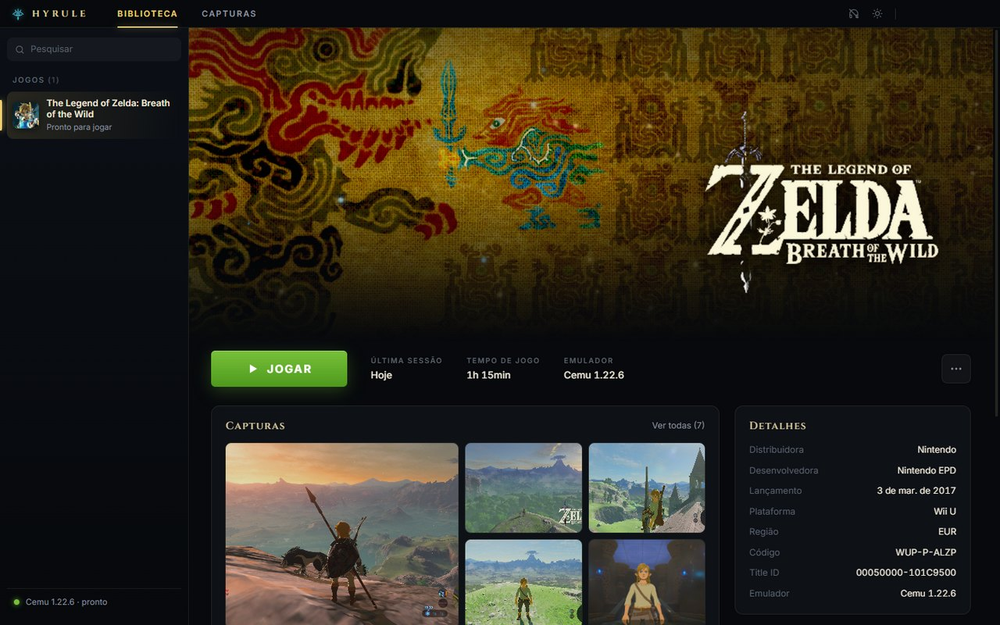
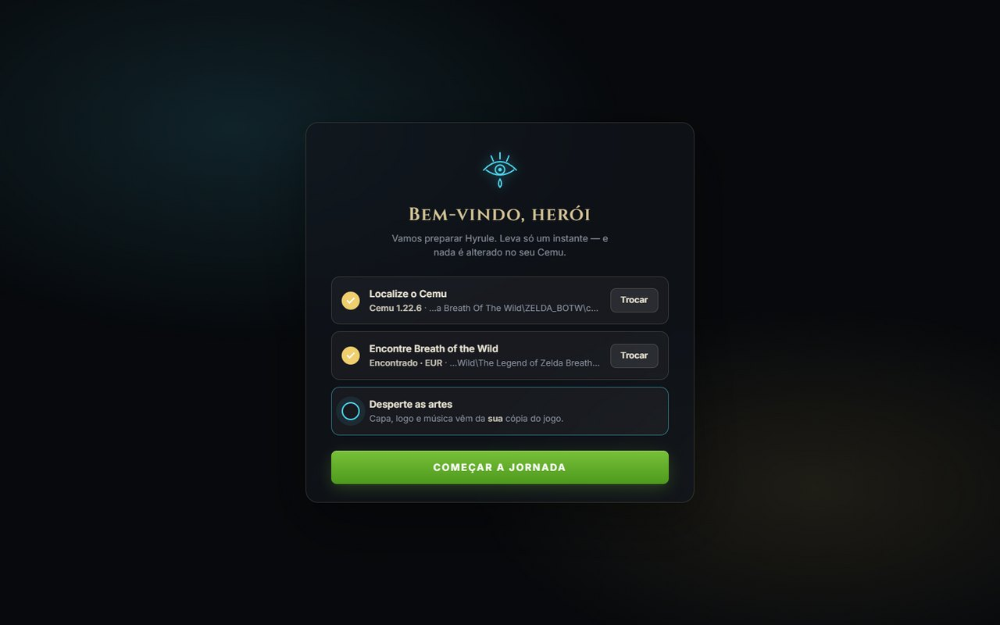
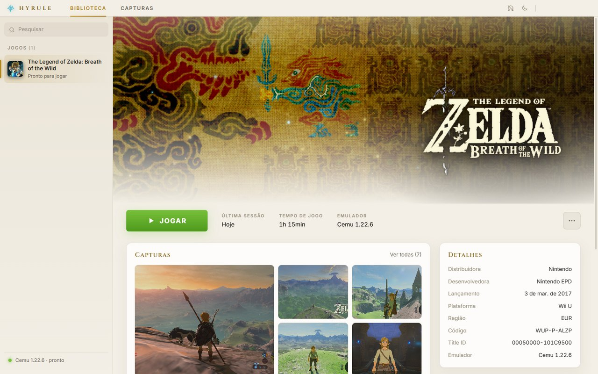
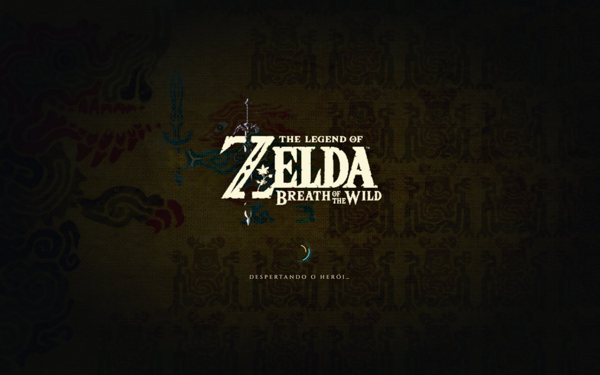
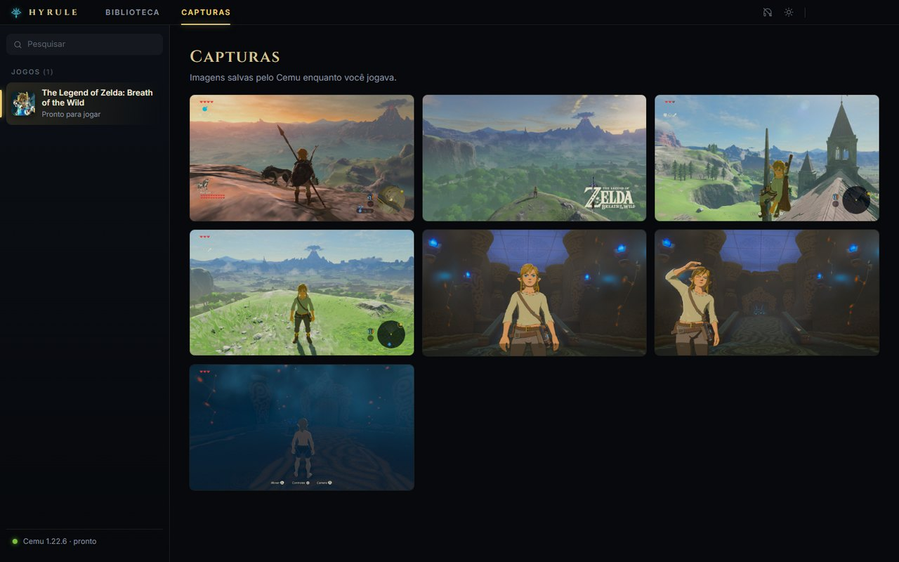
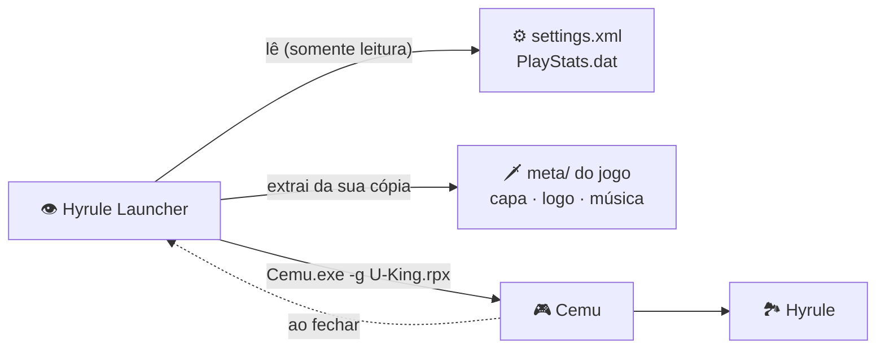
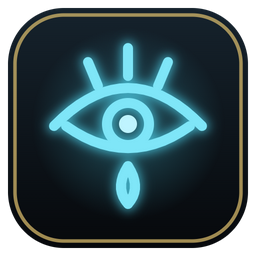

<div align="center">



<br>

<a href="../../releases/latest"></a>

<br><br>


<br><br>

**Transforme o seu Cemu numa biblioteca bonita no estilo Steam,**<br>
**com a capa, a música e o tempo de jogo do seu Breath of the Wild.** 🗡️🛡️

[🧭 Instalação](#-a-jornada-instalação-em-4-santuários) ·
[✨ Recursos](#-recursos) ·
[🖼️ Galeria](#️-galeria) ·
[❓ Dúvidas](#-perguntas-frequentes) ·
[🛠️ Desenvolvimento](#️-para-desenvolvedores)

</div>


> [!NOTE]
> **Projeto de fã, sem fins lucrativos e sem ligação com a Nintendo.** O launcher **não** inclui o jogo, chaves nem
> nenhuma arte da Nintendo. A capa, o logo, o ícone e a música são extraídos, no seu computador, da **sua própria
> cópia** do jogo, na primeira vez que você abre o launcher.

## 🛡️ O que é?

O **Hyrule Launcher** é uma "casca" visual em volta do [Cemu](https://cemu.info), o emulador de Wii U.
Em vez de abrir o Cemu e procurar o jogo na lista, você abre uma biblioteca com animações suaves, a tapeçaria do
Calamity Ganon de fundo e um botão **JOGAR** bem grande, igual à Steam.

> [!IMPORTANT]
> **O Cemu continua exatamente igual.** O launcher só **lê** as configurações dele e o abre com
> `Cemu.exe -g <jogo>`, o mesmo comando que o próprio Cemu usa. Nenhuma configuração, graphic pack ou save é alterado.

<div align="center">
  
</div>


## ✨ Recursos

| | Recurso | Detalhes |
|:-:|---|---|
| 👁️ | **Abertura Sheikah** | O olho Sheikah se desenha em azul brilhante antes de a biblioteca aparecer. |
| 🏞️ | **Capa viva** | A tapeçaria do jogo com câmera lenta, efeito parallax e espíritos dourados flutuando. |
| ▶️ | **Botão JOGAR** | Abre o jogo com uma transição de cinema e minimiza o launcher sozinho. Ao fechar o jogo, ele volta. |
| ⏱️ | **Tempo de jogo real** | Lido do próprio Cemu: `PlayStats.dat` no 2.x e `settings.xml` no 1.x. |
| 📸 | **Suas capturas** | Galeria com as screenshots do Cemu, com visualizador em tela cheia (setas ← → e Esc). |
| 🧩 | **Graphic packs** | Lista dos packs ativos para o BotW (FPS++, Extended Memory…), só para consulta. |
| 🎵 | **Música da abertura** | A vinheta original do Wii U, **desligada por padrão**, com controle de volume. |
| 🌗 | **Tema claro e escuro** | Tema escuro ou "pergaminho", com transição circular. A escolha fica salva. |
| 🪶 | **Leve no jogo** | Enquanto você joga, o launcher fica minimizado e pausa música e animações (GPU livre pro Cemu). |
| 🌍 | **EUR · USA · JPN** | Detecta automaticamente a sua versão do jogo, seja do Cemu 1.x ou 2.x (inclusive no modo portable). |


## 🖼️ Galeria

<table>
  <tr>
    <td width="50%"><p align="center"><sub>🧭 <b>Primeira abertura</b>: aponte o Cemu e pronto</sub></p></td>
    <td width="50%"><p align="center"><sub>🌗 <b>Tema pergaminho</b></sub></p></td>
  </tr>
  <tr>
    <td width="50%"><p align="center"><sub>🎬 <b>"Despertando o herói…"</b> ao clicar em JOGAR</sub></p></td>
    <td width="50%"><p align="center"><sub>📸 <b>Suas capturas</b> do Cemu</sub></p></td>
  </tr>
</table>


## 🎒 Antes da jornada

Confira se você tem tudo na bolsa:

- [x] 🪟 **Windows 10 ou 11** (64 bits)
- [x] 🎮 **Cemu** (1.x ou 2.x) já funcionando no seu PC
- [x] 🗡️ **Zelda: Breath of the Wild** já rodando nesse Cemu (a sua cópia, feita a partir do seu console)

> [!TIP]
> Se o jogo já abre pelo Cemu, você está pronto. O launcher não precisa de mais nada: nem instalação, nem Node, nem
> conta.

## 🧭 A jornada: instalação em 4 santuários

### 🔹 Santuário 1: baixe o launcher

Vá em **[Releases](../../releases/latest)** e baixe o arquivo **`Hyrule-Launcher-vX.Y.Z-win64.zip`**.

### 🔹 Santuário 2: extraia a pasta

Clique com o botão direito no `.zip` e escolha **Extrair tudo…**. Pode ser em qualquer lugar, por exemplo
`C:\Jogos\Hyrule Launcher` ou ao lado da pasta do Cemu.

> [!WARNING]
> Não rode o launcher **de dentro** do `.zip`. Extraia primeiro, senão ele não encontra os próprios arquivos.

### 🔹 Santuário 3: abra e aponte o Cemu

Abra **`Hyrule Launcher.exe`**. Na tela **"Bem-vindo, herói"**:

1. Clique em **Escolher** e selecione o seu **`Cemu.exe`**.
2. O launcher procura o Breath of the Wild sozinho nas pastas do Cemu ✅. Se não achar, clique em **Escolher pasta**
   e aponte a pasta do jogo (a que tem as subpastas `code`, `content` e `meta`).
3. Clique em **Começar a jornada**. As artes e a música são extraídas do seu jogo em menos de 1 segundo.

> [!CAUTION]
> Na primeira vez, o Windows pode mostrar **"O Windows protegeu o computador"**. Isso acontece com qualquer programa
> sem assinatura digital paga. Clique em **Mais informações → Executar assim mesmo**. O código-fonte inteiro está
> aqui no repositório para quem quiser conferir.

### 🔹 Santuário 4: jogue! ▶️

Clique em **JOGAR**. Para ter o launcher sempre à mão, clique com o botão direito no `Hyrule Launcher.exe` →
**Enviar para → Área de trabalho (criar atalho)**.

<div align="center">

🏆 **Missão cumprida!** Que a Deusa Hylia guie seus passos, herói.

</div>


## 🎮 Guia rápido

| Onde | O que faz |
|---|---|
| ▶️ **JOGAR** | Abre o jogo no Cemu. Se o Cemu já estiver aberto, o botão fica azul (**EM EXECUÇÃO**) e leva você até ele. |
| 🎧 **Fone** (barra superior) | **Clique**: liga ou desliga a música. **Passe o mouse**: abre o volume. **Rodinha do mouse**: ajusta o volume. |
| ☀️ / 🌙 **Sol / Lua** | Troca entre o tema escuro e o tema claro. |
| ⋯ **Mais opções** | **Sempre abrir em tela cheia**, abrir o Cemu sem jogo, abrir as pastas do jogo, do Cemu e das capturas, ou **reconfigurar os caminhos**. |
| 📸 **Capturas** | Clique numa imagem para ver em tela cheia. Use ← → para navegar e **Esc** para sair. |

## 🔮 Como funciona



- 🔎 **Detecção:** segue a mesma regra do Cemu para achar as configurações: pasta `portable` → `settings.xml` ao
  lado do exe → `%APPDATA%\Cemu`. O jogo é procurado no histórico do Cemu, na `mlc01` e nas pastas de jogos dele.
- ⏱️ **Tempo de jogo:** é a soma do `PlayStats.dat` (Cemu 2.x, em minutos) com o registro antigo do `settings.xml`
  (Cemu 1.x, em segundos). É a mesma conta que o próprio Cemu faz na lista de jogos.
- 🎨 **Artes:** a tapeçaria vem do `bootTvTex`. O logo é recortado dela, e o espaço que ele deixa é preenchido com o
  próprio padrão do tecido. O ícone vem do `iconTex`, e a música do `bootSound`.

### 📍 Onde ficam os dados do launcher

Tudo fica em `%APPDATA%\Hyrule Launcher\`:

| Arquivo | Conteúdo |
|---|---|
| `setup.json` | Caminhos do Cemu e do jogo |
| `prefs.json` | Tema, música ligada ou desligada, e volume |
| `art\` | Artes e música extraídas do seu jogo |


## ❓ Perguntas frequentes

<details>
<summary><b>🔍 O launcher não encontrou o meu jogo</b></summary>
<br>

Clique em **Escolher pasta** e selecione a pasta do jogo, a que contém `code`, `content` e `meta`. Também funciona
escolher uma pasta "acima" dela: o launcher procura até 3 níveis para dentro. Por enquanto só o **Breath of the
Wild** (EUR, USA ou JPN) é suportado.
</details>

<details>
<summary><b>⏱️ O tempo de jogo está diferente do Cemu</b></summary>
<br>

O launcher lê os mesmos arquivos que o Cemu e atualiza o tempo assim que você fecha o jogo. Se jogou com o launcher
fechado, o tempo novo aparece na próxima vez que ele abrir.
</details>

<details>
<summary><b>🎵 A música não toca</b></summary>
<br>

A música vem **desligada por padrão**. Clique no 🎧 na barra superior para ligar. Ela também pausa sozinha
enquanto o jogo está aberto ou com o launcher minimizado.
</details>

<details>
<summary><b>🔁 Mudei o Cemu ou o jogo de pasta</b></summary>
<br>

Abra **⋯ → Reconfigurar caminhos…** e aponte de novo. Se os caminhos salvos deixarem de existir, a tela de
configuração aparece sozinha.
</details>

<details>
<summary><b>🎮 Meu controle de PlayStation não funciona no jogo</b></summary>
<br>

O Cemu 1.x normalmente lê controles de **Xbox (XInput)**. Se você usa DualSense ou DualShock pela Steam, adicione o
`Hyrule Launcher.exe` na Steam (**Adicionar um jogo → Adicionar um jogo não-Steam**) e abra o launcher por lá. A
Steam reconhece o Cemu aberto pelo launcher e traduz o controle normalmente.
</details>

<details>
<summary><b>🧹 Como desinstalar?</b></summary>
<br>

Apague a pasta do launcher e, se quiser, a pasta `%APPDATA%\Hyrule Launcher`. Nada foi instalado no Windows nem
alterado no Cemu.
</details>

<details>
<summary><b>🛡️ É seguro? Ele mexe no meu save?</b></summary>
<br>

Não mexe. O launcher **nunca escreve** nada nas pastas do Cemu ou do jogo, só lê. Ele grava apenas na própria pasta
dele, em `%APPDATA%\Hyrule Launcher`. O código está todo aberto aqui.
</details>


## 🛠️ Para desenvolvedores

Precisa do [Node.js](https://nodejs.org) 20 ou mais recente.

```bash
git clone https://github.com/lucasmrd/hyrule-launcher.git
cd hyrule-launcher
npm install
npm start           # roda em modo de desenvolvimento
npm run release     # gera dist/Hyrule-Launcher-vX.Y.Z-win64.zip
```

<details>
<summary><b>🗂️ Estrutura do projeto</b></summary>

```text
hyrule-launcher/
├─ src/
│  ├─ main.js          # janela, IPC, abrir o Cemu, monitorar se está rodando
│  ├─ cemu.js          # leitura do Cemu 1.x/2.x: caminhos, jogo, tempo, packs
│  ├─ art.js           # extração de artes/música da cópia do usuário (TGA → PNG, BTSND → WAV)
│  ├─ preload.js       # ponte segura entre a janela e o Node
│  ├─ renderer/        # interface: index.html, styles.css, app.js
│  └─ assets/          # ícone original (olho Sheikah) e fontes Cinzel/Inter (OFL)
├─ tools/              # build, ícone, banner e testes visuais automatizados
└─ docs/               # banner, divisor e capturas do README
```
</details>

**Princípios do projeto:**

- 🪶 **100% visual:** nunca escrever nas pastas do Cemu ou do jogo.
- 🚫 **Zero arquivos da Nintendo** no repositório. Tudo vem da cópia do usuário.
- 🎞️ **Fluidez:** animações só com `transform` e `opacity` (feitas pela GPU), e tudo pausa quando a janela está oculta.


## 📜 Créditos e aviso legal

- Feito com [Electron](https://www.electronjs.org/).
- Fontes [Cinzel](https://github.com/NDISCOVER/Cinzel) e [Inter](https://github.com/rsms/inter), sob a
  [SIL Open Font License 1.1](src/assets/fonts).
- Ícone e banner originais, inspirados na estética Sheikah.
- *The Legend of Zelda*, *Breath of the Wild*, *Hyrule* e *Sheikah* são marcas registradas da **Nintendo**. Este
  projeto não é afiliado, patrocinado nem endossado pela Nintendo nem pela equipe do Cemu. As imagens do jogo nas
  capturas acima vêm da cópia do autor e servem apenas para ilustrar o launcher.
- Código sob a licença [MIT](LICENSE).

<div align="center">
<br>

<br>
<sub>Feito com 💛 por um fã, para fãs. <i>"É perigoso ir sozinho!"</i> Leve este launcher. 🗡️</sub>
</div>
